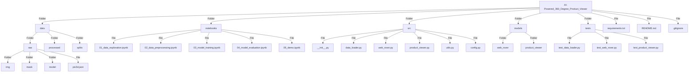

# AI-Powered-360-Degree-Product-Viewer-with-WebRover
This project integrates an AI-driven web agent (WebRover) with an interactive 360-degree product visualization system

```mermaid
graph TD;
    A[AI-Powered_360_Degree_Product_Viewer] -->|Folder| B[data]
    B -->|Folder| B1[raw]
    B1 -->|Folder| B1a[img]
    B1 -->|Folder| B1b[mask]
    B1 -->|Folder| B1c[model]
    B1 -->|File| B1d[pix3d.json]
    B -->|Folder| B2[processed]
    B -->|Folder| B3[splits]

    A -->|Folder| C[notebooks]
    C -->|File| C1[01_data_exploration.ipynb]
    C -->|File| C2[02_data_preprocessing.ipynb]
    C -->|File| C3[03_model_training.ipynb]
    C -->|File| C4[04_model_evaluation.ipynb]
    C -->|File| C5[05_demo.ipynb]

    A -->|Folder| D[src]
    D -->|File| D1[__init__.py]
    D -->|File| D2[data_loader.py]
    D -->|File| D3[web_rover.py]
    D -->|File| D4[product_viewer.py]
    D -->|File| D5[utils.py]
    D -->|File| D6[config.py]

    A -->|Folder| E[models]
    E -->|Folder| E1[web_rover]
    E -->|Folder| E2[product_viewer]

    A -->|Folder| F[tests]
    F -->|File| F1[test_data_loader.py]
    F -->|File| F2[test_web_rover.py]
    F -->|File| F3[test_product_viewer.py]

    A -->|File| G[requirements.txt]
    A -->|File| H[README.md]
    A -->|File| I[.gitignore]
```
