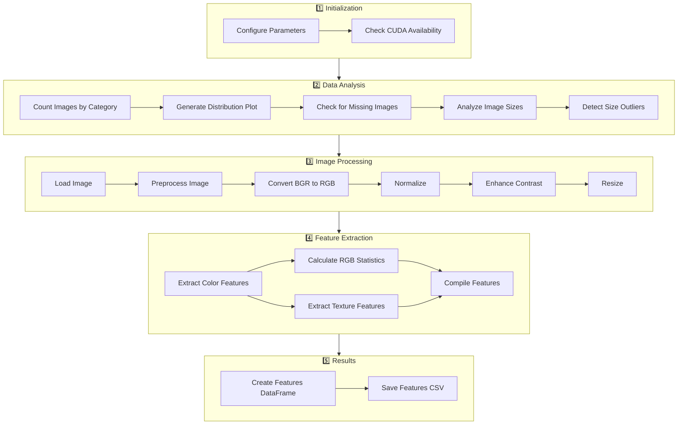

# **AI-Powered 360-Degree Product Viewer with WebRover**  

This project integrates an AI-driven web agent (**WebRover**) with an interactive **360-degree product visualization system**, providing seamless product exploration and intelligent interaction.  

## 📂 **Project Structure**  

```mermaid
graph TD;
    A[AI_Powered_360_Product_Viewer] -->|Folder| B[data]
    B -->|Folder| B1[raw]
    B1 -->|Folder| B1a[product_images]
    B1 -->|Folder| B1b[metadata]
    B1 -->|File| B1c[pix3d.json]
    B -->|Folder| B2[processed]
    B2 -->|Folder| B2a[360_views]
    B2 -->|Folder| B2b[optimized_images]
    B -->|Folder| B3[models]
    B3 -->|File| B3a[webrover_agent.pkl]
    B3 -->|File| B3b[image_processor.pkl]

    A -->|Folder| C[notebooks]
    C -->|File| C1[01_image_processing.ipynb]
    C -->|File| C2[02_360_view_generation.ipynb]
    C -->|File| C3[03_webrover_development.ipynb]
    C -->|File| C4[04_integration_testing.ipynb]
    C -->|File| C5[05_performance_analysis.ipynb]

    A -->|Folder| D[src]
    D -->|Folder| D1[image_processing]
    D1 -->|File| D1a[preprocessor.py]
    D1 -->|File| D1b[view_generator.py]
    D -->|Folder| D2[ai_agent]
    D2 -->|File| D2a[webrover.py]
    D2 -->|File| D2b[nlp_processor.py]
    D2 -->|File| D2c[action_executor.py]
    D -->|Folder| D3[web_interface]
    D3 -->|File| D3a[viewer.py]
    D3 -->|File| D3b[interaction_handler.py]
    D3 -->|File| D3c[api.py]
    D -->|Folder| D4[utils]
    D4 -->|File| D4a[data_loader.py]
    D4 -->|File| D4b[metrics.py]

    A -->|Folder| E[config]
    E -->|File| E1[image_processing_config.yaml]
    E -->|File| E2[webrover_config.yaml]
    E -->|File| E3[viewer_config.yaml]

    A -->|Folder| F[tests]
    F -->|File| F1[test_image_processing.py]
    F -->|File| F2[test_webrover.py]
    F -->|File| F3[test_viewer.py]

    A -->|Folder| G[docs]
    G -->|File| G1[setup.md]
    G -->|File| G2[api_documentation.md]
    G -->|File| G3[user_guide.md]

    A -->|Folder| H[static]
    H -->|Folder| H1[css]
    H -->|Folder| H2[js]
    H -->|Folder| H3[assets]

    A -->|File| I[requirements.txt]
    A -->|File| J[setup.py]
    A -->|File| K[README.md]
```



## **🛠 Workflow Overview**  



### **🔹 Key Features**  

✔ **AI-Driven Web Agent (WebRover):** Automates product interaction and analysis  
✔ **360-Degree Product Visualization:** Enables full product exploration  
✔ **Advanced Image Processing:** Enhances images for better clarity and insights  
✔ **Feature Extraction:** Captures essential visual and metadata details  
✔ **Seamless Integration:** Connects AI insights with user interactions  

---

📌 **Installation & Setup**  
```bash
# Clone the repository
git clone https://github.com/yourusername/AI-Powered-360-Degree-Product-Viewer.git
cd AI-Powered-360-Degree-Product-Viewer

# Install dependencies
pip install -r requirements.txt
```

📌 **Run the System**  
```bash
python src/web_interface/api.py
```

📌 **Contributing**  
Feel free to open issues or submit pull requests to enhance the project. 🚀
