# AI-Powered-360-Degree-Product-Viewer-with-WebRover
This project integrates an AI-driven web agent (WebRover) with an interactive 360-degree product visualization system

```mermaid
graph TD;
    A[AI-Powered_360_Degree_Product_Viewer] -->|Folder| B[data]
    B -->|Folder| B1[raw]
    B1 -->|Folder| B1a[img]
    B1 -->|Folder| B1b[mask]
    B1 -->|Folder| B1c[model]
    B1 -->|File| B1d[pix3d.json]
    B -->|Folder| B2[processed]
    B -->|Folder| B3[splits]

    A -->|Folder| C[notebooks]
    C -->|File| C1[01_data_exploration.ipynb]
    C -->|File| C2[02_data_preprocessing.ipynb]
    C -->|File| C3[03_model_training.ipynb]
    C -->|File| C4[04_model_evaluation.ipynb]
    C -->|File| C5[05_demo.ipynb]

    A -->|Folder| D[src]
    D -->|File| D1[__init__.py]
    D -->|File| D2[data_loader.py]
    D -->|File| D3[web_rover.py]
    D -->|File| D4[product_viewer.py]
    D -->|File| D5[utils.py]
    D -->|File| D6[config.py]

    A -->|Folder| E[models]
    E -->|Folder| E1[web_rover]
    E -->|Folder| E2[product_viewer]

    A -->|Folder| F[tests]
    F -->|File| F1[test_data_loader.py]
    F -->|File| F2[test_web_rover.py]
    F -->|File| F3[test_product_viewer.py]

    A -->|File| G[requirements.txt]
    A -->|File| H[README.md]
    A -->|File| I[.gitignore]
```

📁 AI_Product_Viewer/
│
├── 📁 notebooks/
│   ├── 📓 01_image_processing.ipynb         # Image processing and preparation
│   ├── 📓 02_360_view_generation.ipynb      # 360-degree view creation
│   ├── 📓 03_webrover_development.ipynb     # AI agent development
│   ├── 📓 04_integration_testing.ipynb      # System integration
│   └── 📓 05_performance_analysis.ipynb     # Performance evaluation
│
├── 📁 data/
│   ├── 📁 raw/
│   │   ├── 📁 product_images/              # Original product images
│   │   └── 📁 metadata/                    # Product metadata
│   ├── 📁 processed/
│   │   ├── 📁 360_views/                   # Generated 360° views
│   │   └── 📁 optimized_images/            # Processed images
│   └── 📁 models/
│       ├── 📄 webrover_agent.pkl           # Trained AI agent model
│       └── 📄 image_processor.pkl          # Image processing model
│
├── 📁 src/
│   ├── 📁 image_processing/
│   │   ├── 📄 preprocessor.py
│   │   └── 📄 view_generator.py
│   ├── 📁 ai_agent/
│   │   ├── 📄 webrover.py
│   │   ├── 📄 nlp_processor.py
│   │   └── 📄 action_executor.py
│   ├── 📁 web_interface/
│   │   ├── 📄 viewer.py
│   │   ├── 📄 interaction_handler.py
│   │   └── 📄 api.py
│   └── 📁 utils/
│       ├── 📄 data_loader.py
│       └── 📄 metrics.py
│
├── 📁 config/
│   ├── 📄 image_processing_config.yaml
│   ├── 📄 webrover_config.yaml
│   └── 📄 viewer_config.yaml
│
├── 📁 tests/
│   ├── 📄 test_image_processing.py
│   ├── 📄 test_webrover.py
│   └── 📄 test_viewer.py
│
├── 📁 docs/
│   ├── 📄 setup.md
│   ├── 📄 api_documentation.md
│   └── 📄 user_guide.md
│
├── 📁 static/
│   ├── 📁 css/
│   ├── 📁 js/
│   └── 📁 assets/
│
├── 📄 requirements.txt
├── 📄 setup.py
└── 📄 README.md

flowchart TB
    subgraph Init["Initialization"]
        A[Configure Parameters] --> B[Check CUDA Availability]
    end

    subgraph Analysis["Data Analysis"]
        C[Count Images by Category] --> D[Generate Distribution Plot]
        D --> E[Check for Missing Images]
        E --> F[Analyze Image Sizes]
        F --> G[Detect Size Outliers]
    end

    subgraph Processing["Image Processing"]
        H[Load Image] --> I[Preprocess Image]
        I --> J[Convert BGR to RGB]
        J --> K[Normalize]
        K --> L[Enhance Contrast]
        L --> M[Resize]
    end

    subgraph Features["Feature Extraction"]
        N[Extract Color Features] --> O[Calculate RGB Statistics]
        N --> P[Extract Texture Features]
        O --> Q[Compile Features]
        P --> Q
    end

    subgraph Output["Results"]
        R[Create Features DataFrame] --> S[Save Features CSV]
    end

    Init --> Analysis
    Analysis --> Processing
    Processing --> Features
    Features --> Output
    