# **AI-Powered 360-Degree Product Viewer with WebRover**  

This project integrates an AI-driven web agent (**WebRover**) with an interactive **360-degree product visualization system**, providing seamless product exploration and intelligent interaction.  

## 📂 **Project Structure**  


## **🛠 Workflow Overview**  

```mermaid
flowchart TB
    subgraph Init["1️⃣ Initialization"]
        A[Configure Parameters] --> B[Check CUDA Availability]
    end

    subgraph Analysis["2️⃣ Data Analysis"]
        C[Count Images by Category] --> D[Generate Distribution Plot]
        D --> E[Check for Missing Images]
        E --> F[Analyze Image Sizes]
        F --> G[Detect Size Outliers]
    end

    subgraph Processing["3️⃣ Image Processing"]
        H[Load Image] --> I[Preprocess Image]
        I --> J[Convert BGR to RGB]
        J --> K[Normalize]
        K --> L[Enhance Contrast]
        L --> M[Resize]
    end

    subgraph Features["4️⃣ Feature Extraction"]
        N[Extract Color Features] --> O[Calculate RGB Statistics]
        N --> P[Extract Texture Features]
        O --> Q[Compile Features]
        P --> Q
    end

    subgraph Output["5️⃣ Results"]
        R[Create Features DataFrame] --> S[Save Features CSV]
    end

    Init --> Analysis
    Analysis --> Processing
    Processing --> Features
    Features --> Output
```



### **🔹 Key Features**  

✔ **AI-Driven Web Agent (WebRover):** Automates product interaction and analysis  
✔ **360-Degree Product Visualization:** Enables full product exploration  
✔ **Advanced Image Processing:** Enhances images for better clarity and insights  
✔ **Feature Extraction:** Captures essential visual and metadata details  
✔ **Seamless Integration:** Connects AI insights with user interactions  

---

📌 **Installation & Setup**  
```bash
# Clone the repository
git clone https://github.com/yourusername/AI-Powered-360-Degree-Product-Viewer.git
cd AI-Powered-360-Degree-Product-Viewer

# Install dependencies
pip install -r requirements.txt
```

📌 **Run the System**  
```bash
python src/web_interface/api.py
```

📌 **Contributing**  
Feel free to open issues or submit pull requests to enhance the project. 🚀
